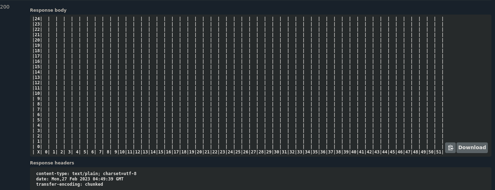
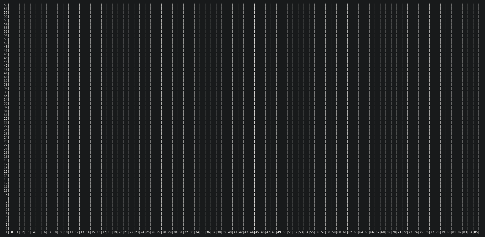

# Rover Code Challenge

You can find the challenge description [here](./DESCRIPTION.md).

## Details

- The description does not mention restrictions, but I'll consider the following:
  - Multiple rovers can't be in the same position at the same time.
  - For obvious reasons, the rovers cannot move outside the plateau.
  - Both restrictions will output an error if triggered.
- Besides the `Forward` movement, I'm adding the `Backward` movement.
  - Controlling the rover without backward movement is possible, but it adds flexibility to the control center.
  - All `M` movements were replaced by `F`.
  - A simple way to show how the `backward` movement increases maneuverability, consider that undoing a movement requires one cycle, while it would take three cycles without the `backward` option.
  -
  |without backward| with backward|
  |---|---|
  |LLF| B |

## V1

Contains the first built version without (many) external packages.

### To run the code

- access the v1 folder: `cd v1`;
- run `go test -v ./...`

## V2

The second version contains an API-like interaction to control the rovers using swagger to simplify the app usage without a proper front-end.
> The api allows the game to be accessed by multiple players, considering they are in the same local network.

### To play with it

- access `v2` folder from the terminal: cd v2;
- run `go run main.go` (assuming go is installed);
- open the [swagger page](http://localhost:8080/swagger/index.html) and have fun.

#### Notes

- If playing thru swagger only, with an unchanged browser portview, in a 1920x1080 screen, plateaus as big as 24x51 will be funnier.

  

- If playing thru a windowed, directly accessed page, with an unchanged browser portview, in a 1920x1080 screen, plateaus as big as 59x85 will be funnier.

  

- Due to auto-padding, plateaus with a width or height higher than 100 will require a zoomed-out page or a higher resolution / bigger screen.

## Next steps

- Dockerize the API;
- Add Makefile shortcuts;
- Make a running CLI game playable thru the terminal;
- It requires very little to adapt the game, adding shooting, health points, and making the rover destroyable;
  - I'd add a global clock to all objects in the plateau;
  - Each missile flies one position per cycle;
  - A missile can destroy another missile;
  - Each rover can have only one flying missile at a time.
